# 🎓 VFSTR ACSE Timetable Scheduler — Complete Feature & Sub-Feature Report

> **System:** VFSTR Automated Timetable Scheduler  
> **Institution:** Vignan's Foundation for Science, Technology & Research, Vadlamudi, Guntur  
> **Stack:** Next.js 14 (App Router) + FastAPI + PostgreSQL + Celery + OR-Tools  
> **Version:** Production Build (Docker Compose)  
> **Date:** July 2026  

---

## System Topology Overview

```mermaid
graph TD
    subgraph "Browser (Next.js 14)"
        P1["/ Dashboard"] --> P2["/import Excel"]
        P1 --> P3["/configure Data"]
        P1 --> P4["/schedule Workbench"]
        P1 --> P5["/export Downloads"]
    end

    subgraph "FastAPI Backend (port 8000)"
        API1["POST /api/v1/import/excel"]
        API2["GET/POST /api/v1/configure/*"]
        API3["GET /api/v1/timetable/version/:id"]
        API4["POST /api/v1/solve"]
        API5["WS /api/v1/solve/:id/stream"]
        API6["POST /api/v1/export/excel/cohort/:key"]
        API7["POST /api/v1/export/pdf/*"]
        API8["POST /api/v1/solve/generate-from-wizard"]
        API9["GET /api/v1/validate/:version_id"]
        API10["GET /api/v1/timetable/faculty/:id"]
    end

    subgraph "Solver Engine (Celery Worker)"
        SOL1["CP-SAT Solver (OR-Tools)"]
        SOL2["Genetic Algorithm"]
        SOL3["Hybrid CP-SAT + GA"]
        SOL4["Constraint Checker (20 rules)"]
        SOL5["Fitness Evaluator"]
        SOL6["Incremental Validator"]
        SOL7["Infeasibility Diagnostics"]
    end

    subgraph "Parser / Exporter"
        PAR1["Excel Parser (openpyxl) — V3/V5"]
        EXP1["Excel Exporter — per-cohort multi-section"]
        EXP2["PDF Exporter — per-section / per-faculty"]
    end

    subgraph "PostgreSQL (port 5432)"
        DB1["timetable_entries — 1000 slots"]
        DB2["faculty — 80+ records"]
        DB3["sections — 44 sections"]
        DB4["rooms — 35 venues"]
        DB5["solver_runs — version history"]
        DB6["clash_reports — violation log"]
        DB7["section_subjects — assignments"]
        DB8["multi_faculty_assignments"]
    end

    P4 --> API4
    P4 --> API5
    P2 --> API1
    P3 --> API2
    P4 --> API3
    P5 --> API6
    P5 --> API7
    API4 --> SOL1
    API1 --> PAR1
    API6 --> EXP1
    API7 --> EXP2
    SOL1 --> DB1
    SOL1 --> DB5
```



---

## 1. 🏠 Dashboard Page (`/`)

> Entry point for the entire application. Shows live system status, version history, and quick actions.

### 1.1 KPI Stats Row
- **Sections badge** — 44 active ACSE sections
- **Faculty badge** — ~80 faculty members tracked
- **Rooms badge** — 35 venue slots (classrooms + labs)
- **Slots badge** — 1,000 weekly timetable slots (V5 baseline)

### 1.2 Clash Summary Card
- Live red badge showing **51 hard violations** in V5 (room clash baseline)
- Color: `--color-danger` red when violations > 0, `--color-success` green when 0
- Pulls from `GET /api/v1/validate/5` on mount

### 1.3 Version Timeline
- Horizontal card row: **V1 (10-Jul)**, **V2 (11-Jul)**, **V3 (13-Jul)**, **V4 (14-Jul)**, **V5 (15-Jul)**
- Each card shows: date, slot count, hard violation count
- V5 highlighted as current baseline
- Source: `GET /api/v1/timetable/versions`

### 1.4 Quick Action Buttons
| Button | Action |
|---|---|
| Import Excel | → `/import` |
| View Timetable | → `/schedule` |
| Export | → `/export` |
| Run AI Solver | → `/schedule` (triggers solver) |

### 1.5 AI Solver CTA Banner
- Gradient blue-to-indigo card showing system readiness
- "Run CP-SAT Solver" primary button
- Sub-text: "591,360 binary variables · 44 ACSE sections"

---

## 2. 📥 Import Page (`/import`)

> Parse existing VFSTR Excel timetable files (V3/V5 format) into the PostgreSQL database.

### 2.1 Drag-and-Drop File Upload Zone
- Accepts `.xlsx` files only
- Visual drag-highlight with dashed amber border
- File size display once dropped
- Internally calls `POST /api/v1/import/excel` (multipart form)

### 2.2 Excel Parser Engine (`backend/parser/excel_parser.py`)

#### 2.2.1 Sheet Detection
- Reads all sheets from uploaded workbook
- Identifies section sheets vs. `MINORHONORS` master sheet
- Handles V3 and V5 format differences automatically

#### 2.2.2 Cell Anatomy Parser
- **Row 7–12** → Day rows (MON–SAT)
- **Period columns** → Periods 1–8 with BREAK and LUNCH detection
- **Each cell** → extracts: Subject Code, Room Code (red font), Faculty name (below grid)

#### 2.2.3 Subject Type Detection
```python
# Auto-detected from subject code suffix
"DS"      → Lecture (L)
"DS(T)"   → Tutorial (T)
"DS(P)"   → Practical/Lab (P)
"DS(T&P)" → Tutorial + Practical combined
"LIBRARY" → Library slot (blocked)
"BREAK"   → 09:55-10:10 (blocked)
"LUNCH"   → 12:40-13:40 (blocked)
```

#### 2.2.4 Faculty Legend Parser
- Reads 2-column faculty table below the grid (rows 14–22)
- Maps `Subject(L)` → Lead Professor
- Maps `Subject(P)/(T&P)` → Lab team (comma-separated names)

#### 2.2.5 MINORHONORS Sheet Parser
- Reads the special synchronized cross-section sheet
- Extracts department headers (AIML, CS, CSBS, DS, IoT)
- Records room numbers and instructor assignments

### 2.3 Parse Progress Display
- Step-by-step progress: "Reading sheets... Found 44 sections... Extracted 1,000 slots..."
- Count summary: sections parsed, faculty mappings, room codes detected

### 2.4 Clash Report Preview
- Live clash table before confirmation: `Day | Period | Room | Section A | Section B | Conflict`
- Badge count: "51 Room Clashes Detected in V5"
- Source: `conflict_checker.py` → `detect_room_clashes()`

### 2.5 Version Save
- Creates a new `solver_runs`/version record in DB
- Labels it with effective date and slot count
- Confirm / Cancel buttons

---

## 3. ⚙️ Configure Page (`/configure`)

> Master data management for all entities required before solver can run.

### 3.1 Faculty Management Tab

#### 3.1.1 Faculty Table
- Columns: Emp ID | Name | Designation | AICTE Max Hrs/Week | Max Daily Cap | Type | Availability | Actions
- Sorted by designation rank (Professor → Associate → Assistant)

#### 3.1.2 Add / Edit Faculty Modal
- Fields: Full Name, Employee ID, Designation (Professor / Associate / Assistant), Max Hours/Week (12/14/16), Max Daily Classes, External toggle
- Calls `POST /api/v1/configure/faculty` or `PATCH /api/v1/configure/faculty/:id`

#### 3.1.3 Delete Faculty
- Confirmation prompt
- Calls `DELETE /api/v1/configure/faculty/:id`

#### 3.1.4 Faculty Availability Grid Modal
- 6×8 day-period clickable matrix (MON–SAT × Periods 1–8)
- Click a cell → toggle unavailable (grey) / available (green)
- Stored as `availability: {day: [period_ids_blocked]}`

#### 3.1.5 Bulk CSV Import
- Upload faculty CSV → batch insert via `POST /api/v1/configure/faculty/bulk-csv`

#### 3.1.6 Search & Filter
- Real-time search by name, employee ID, or designation

### 3.2 Venues (Rooms) Tab

#### 3.2.1 Rooms Table
- Columns: Room Code | Building Block | Floor | Room Type | Capacity | GPU Capable | Status | Actions

#### 3.2.2 Room Types Supported
| Type | Code Examples | Notes |
|---|---|---|
| Classroom | 601, 602, 619 | Standard lecture halls |
| Computer Lab | 604, 605, 611 | Standard PC labs |
| GPU Lab | AFTF-12, AFTF-13, AFTF-14 | High-performance DL/CV labs |
| Project Room | AFF-09, AFF-10 | Small group project rooms |

#### 3.2.3 Add / Edit Room Modal
- Fields: Room Code, Building Block, Floor, Room Type, Capacity, GPU Capable toggle, Available toggle
- Calls `POST /api/v1/configure/rooms` or `PATCH /api/v1/configure/rooms/:id`

#### 3.2.4 GPU Capability Flag
- When `gpu_capable = true` → solver preferentially assigns DL/CV/GenAI labs to these rooms
- Rooms: `AFTF-12`, `AFTF-13`, `AFTF-14` (HC-06 enforcement)

### 3.3 Curriculum (Subjects) Tab

#### 3.3.1 Subjects Table
- Columns: Course Code | Course Title | L-T-P Split | Slot Type | Continuous Lock | GPU Required | Actions

#### 3.3.2 L-T-P Credit System
- **L (Lecture):** Single periods, any classroom
- **T (Tutorial):** Single periods, requires tutorial room
- **P (Practical):** 2-period consecutive blocks, requires lab room
- Each subject stores: `lecture_hours`, `tutorial_hours`, `lab_hours`

#### 3.3.3 Consecutive Period Lock
- `requires_consecutive: 2` → solver guarantees 2 back-to-back periods
- `requires_consecutive: 3` → for 3-hour lab blocks
- Enforced by HC-08 in the solver

#### 3.3.4 Add / Edit Subject Modal
- Fields: Course Code, Full Name, L hours, T hours, P hours, GPU Required, Slot Type dropdown

### 3.4 Section Team Mapping Tab

> The **assignment engine** — defines which faculty teaches which subject to which section.

#### 3.4.1 Target Section Selector
- Dropdown of all 44 sections fetched from `GET /api/v1/sections`

#### 3.4.2 Curriculum Subject Selector
- Dropdown of all subjects with code + full name

#### 3.4.3 Weekly Credit Slot Allocation
- Number inputs: Lecture Slots (L), Tutorial Slots (T), Lab Block Slots (P)
- Total guard: errors if > 40 slots/week

#### 3.4.4 Theory Lead Professor (L)
- Single-select dropdown from faculty pool
- This faculty appears in lecture cells and the legend `Subject(L): Dr. Name`

#### 3.4.5 Practical Lab Lead Professor (P)
- Single-select dropdown
- This faculty leads the lab session

#### 3.4.6 Lab Assistant Instructors / TAs
- Checkbox multi-select from full faculty pool
- Up to 3 co-faculty
- Stored in `multi_faculty_assignments` table
- Appear in right column of legend as `Subject(T&P): Lead, TA1, TA2, TA3`

#### 3.4.7 Save Assignment
- Calls `POST /api/v1/section-subjects/batch-assign`
- Creates `section_subjects` record + `multi_faculty_assignments` records

---

## 4. 📅 Schedule Workbench (`/schedule`)

> The main timetable viewer, editor, and AI solver control center. Has 4 view modes.

### 4.1 Version Selector Bar
- Dropdown shows all saved versions with date + hard violation count
- Switching version reloads all slot data for selected version
- Source: `GET /api/v1/timetable/versions`

### 4.2 Mode 1: Single Section Grid View

#### 4.2.1 Section Selector
- Dropdown grouped by cohort: II AIML (A-L), III AIML (A-G), IV AIML (A-E), CS/DS, CSBS/IOT
- Selecting a section loads slots from `GET /api/v1/timetable/version/:id?section_name=...`

#### 4.2.2 TimetableGrid Component (`TimetableGrid.tsx`)

##### Cell Anatomy (3-Line Display)
```
┌──────────────────────┐
│ DS           Line 1  │  ← Subject Code (Bold Black)
│ 619          Line 2  │  ← Room Code (Bold Red)
│ Dr. Reddy    Line 3  │  ← Faculty Short Name (Italic Grey)
└──────────────────────┘
```

##### Special Column Handling
- **BREAK column** (09:55–10:10): Merged across all 6 rows with "B R E A K" vertical text (grey bg)
- **LUNCH column** (12:40–1:40): Merged across all 6 rows with "L U N C H" vertical text (grey bg)

##### Lab Cell Spanning
- Lab slots with `spanPeriods: 2` use `colSpan={2}` to span two period columns
- Visually indicates 2-period consecutive lab block

##### Clash Highlighting
- Clash cells: `bg-red-100` + `border-l-4 border-l-red-600`
- Hover tooltip: "CLASH: Room 604 double-booked"

##### Drag-and-Drop Slot Swap
- Dragging a cell → fires `onSlotSwap(entryId, targetDay, targetPeriod)`
- Calls `PATCH /api/v1/timetable/entries/:id` with new time slot

#### 4.2.3 Faculty Legend Below Grid (2-Column Table)
- Left column: `Subject Name(L): Dr. Lead Faculty` — all lecture assignments
- Right column: `Subject Name(P): Lead, TA1, TA2...` — all lab team assignments
- Auto-generated from slot data, de-duplicated by subject code

#### 4.2.4 Section Stats Sidebar Card
- Section name, total slots, Lab (P) count, Hard Clashes (green if 0 / red if > 0), Version

#### 4.2.5 AI Solver Panel (Sidebar)
- Algorithm selector: CP-SAT / Genetic Algorithm / Hybrid CP-SAT+GA
- **"Run AI Solver Engine"** button → `POST /api/v1/solve`
- Progress bar: animates as Celery task progresses via WebSocket
- Status: Generation N • Runtime Ns • Hard Clashes: N badge
- On complete: "100% Clash-Free Timetable Generated!" emerald badge

### 4.3 Mode 2: Vertical Stack View

#### 4.3.1 Cohort Selector
- Dropdown: II AIML (A-L), III AIML (A-G), IV AIML (A-E), CS/DS, CSBS/IOT

#### 4.3.2 Stacked Section Rendering
- All sections in the selected cohort rendered vertically
- Each section block follows this layout:
  1. **Academic year header** (Academic year 2026-27 I Semester)
  2. **Purple section banner** (e.g. `II AIML-A`)
  3. **Period header row** (Periods 1–8 + BREAK + LUNCH)
  4. **Time range row** (8:15-9:05 etc.)
  5. **MON–SAT grid** with cell data
  6. **2-column faculty legend** (L left, P right)
  7. **3 blank spacer rows** before next section

#### 4.3.3 Excel Export Match
- Stack view visually mirrors the Excel export format exactly
- Purple banner = `#C084FC` fill
- Red font = `text-red-600` for room codes
- Vertical BREAK/LUNCH = matching Excel merged cell style

### 4.4 Mode 3: Faculty Schedules View

#### 4.4.1 Faculty Selector
- Dropdown of all faculty members from `GET /api/v1/faculty`
- Shows designation in option label

#### 4.4.2 Faculty Timetable Grid
- Loads from `GET /api/v1/timetable/faculty/:id?version_id=N`
- Same `TimetableGrid` component with `sectionName = "Dr. Name Schedule"`
- Each cell shows: subject code, room code, section name (instead of faculty name)

#### 4.4.3 Faculty Header Card
- Name + Designation + Department
- Weekly Teaching Load vs Max (e.g. "14 Hours / Max 16 Hours")

#### 4.4.4 Download Faculty PDF
- Button: `GET /api/v1/export/pdf/faculty/:id?version_id=N`
- Downloads: `VFSTR_V5_Schedule_Dr_Reddy.pdf`
- Individual A4 portrait PDF with the faculty's week grid

### 4.5 Mode 4: Create Timetable Wizard

#### Step 1 — Academic Scope & Faculty Workload Cap
- **Branch selector**: AIML / CS / DS / CSBS / IOT
- **Year level**: II Year / III Year / IV Year
- **Section checkboxes**: tick any combination of available sections
- **Max daily teaching hours slider**: 3–6 (enforced per faculty per day)

#### Step 2 — Multi-Faculty Lab Team Assignments
- Pre-loaded with year-level curriculum template (editable)
- Per-subject row: Subject Code | Type | Lead Faculty | Co-Faculty checkboxes | Weekly Hours | Consecutive Slots
- "Add Subject" button → creates new blank assignment row
- Validates each subject has at least one faculty assigned

#### Step 3 — Venue Matrix & Period Locks
- **Preferred Block**: Block-VI (601-619) / Block-II (215-218) / NB-Block / AFTF
- **Period lock pins**: fixed specific subject-to-period assignments
- Room type auto-matching: GPU labs preferred for DL/CV/GenAI

#### Step 4 — 0-Clash AI Solve
- Review summary: sections, subjects, faculty count
- **"Generate Clash-Free Timetable"** → `POST /api/v1/solve/generate-from-wizard`
- Loading spinner with status messages
- On success → auto-switches to Single Section Grid mode with fresh data
- On INFEASIBLE → shows detailed error with suggested fixes

---

## 5. 📤 Export Page (`/export`)

> Download timetable data in multiple formats for printing, distribution, and archiving.

### 5.1 Excel Exports

#### 5.1.1 Single Version Full Excel (`POST /api/v1/export/excel?version_id=N`)
- All 44 sections in one workbook
- Each section on a separate sheet tab
- Sheet name = section name (e.g. `II AIML-A`)

#### 5.1.2 Cohort Excel Export (`POST /api/v1/export/excel/cohort/:key?version_id=N`)
- One workbook per cohort group: II_AIML, III_AIML, IV_AIML, CS_DS, CSBS_IOT
- Sections stacked **vertically** on a single sheet (not separate tabs)
- **Section layout per block:**
  - Row 2: "Academic year 2026-27 (I Semester)" centered header
  - Row 4: Purple banner `#C084FC` with section name
  - Row 5: Period numbers 1–8 + BREAK/LUNCH merged
  - Row 6: Time strings (8:15-9:05, etc.)
  - Rows 7–12: MON–SAT grid cells (Black subject, Red room font)
  - Rows 14+: 2-column faculty legend (L left / P right)
  - 3 blank spacer rows before next section

#### 5.1.3 Minors/Honors Master Sheet Export (`POST /api/v1/export/excel/minors-honors?version_id=N`)
- Exports the department-wide synchronized Minors/Honors slots
- Yellow headers (`#FACC15`) per department (AIML, CS, CSBS, DS, IoT)
- Shows room codes and instructor assignments

### 5.2 PDF Exports

#### 5.2.1 All Sections PDF Bundle (`POST /api/v1/export/pdf/sections?version_id=N`)
- One PDF with all 44 sections
- A4 portrait, 1 section per page
- Purple banner, grid with colour-coded slot types

#### 5.2.2 Faculty Weekly Schedules PDF Bundle (`POST /api/v1/export/pdf/faculty?version_id=N`)
- One PDF with all faculty individual schedules
- Each faculty: header card (name, load) + 6×8 grid

#### 5.2.3 Single Faculty PDF (`GET /api/v1/export/pdf/faculty/:id?version_id=N`)
- Individual download for one faculty member
- Available from Faculty Schedules mode on `/schedule`

### 5.3 Room Utilization Report (planned)
- Which rooms are free vs. occupied each period
- Coverage: all 35 rooms × 6 days × 8 periods

---

## 6. 🧠 AI Solver Engine

> The constraint-solving core that generates clash-free timetables.

### 6.1 Solver Algorithms

#### 6.1.1 CP-SAT Solver (`backend/solver/csat_solver.py`)
- Uses **Google OR-Tools CP-SAT** engine
- 591,360 binary decision variables
- Variables: `x[section][subject][day][period][room]`
- Hard constraint propagation with backtracking
- Default timeout: 120 seconds
- Best for: guaranteed optimal or near-optimal solutions

#### 6.1.2 Genetic Algorithm (`backend/solver/genetic_algorithm.py`)
- Population-based evolutionary search
- Config: `population=200, generations=1000, mutation_rate=0.05, elite_count=10`
- Selection: tournament selection with elitism
- Crossover: uniform crossover on day-period genes
- Mutation: random slot reassignment

#### 6.1.3 Hybrid CP-SAT + GA
- Phase 1: GA finds a feasible initial solution
- Phase 2: CP-SAT polishes it to minimize soft violations
- Best for: large instances where pure CP-SAT times out

### 6.2 Hard Constraints (NEVER violated in final output)

| ID | Constraint | Description |
|---|---|---|
| HC-01 | Room Conflict | No two sections in same room at same time |
| HC-02 | Faculty Double-Book | No faculty teaching two sections simultaneously |
| HC-03 | Student Conflict | Sections sharing students cannot overlap |
| HC-04 | Subject Frequency | Each subject taught exactly N times/week per section |
| HC-05 | Room Capacity | Room capacity ≥ section strength |
| HC-06 | Room Type Match | Labs only in lab rooms, GPU subjects only in GPU labs |
| HC-07 | Break/Lunch Block | BREAK (09:55-10:10) and LUNCH (12:40-13:40) always blocked |
| HC-08 | Lab Consecutiveness | Lab subjects always in 2+ consecutive periods |
| HC-09 | Faculty Availability | Faculty not assigned during marked unavailable slots |
| HC-10 | No 4-Consecutive Teaching | Faculty cannot teach 4+ consecutive periods |

### 6.3 Soft Constraints (Minimized, not guaranteed)

| ID | Weight | Description |
|---|---|---|
| SC-01 | 50 | Prefer mornings for theory lectures |
| SC-02 | 30 | Spread lab slots across the week |
| SC-03 | 10 | Balance faculty daily load |
| SC-04 | 5  | Avoid first/last periods for senior faculty |
| SC-05 | 20 | Keep same-subject slots on different days |
| SC-06 | 5  | Prefer section rooms within same block |
| SC-07 | 100| Respect faculty preference days |
| SC-08 | 15 | Minimize room changes per section per day |
| SC-09 | 10 | Prefer tutorial immediately after lecture |
| SC-10 | 5  | Balance load across rooms |

### 6.4 Fitness Evaluator (`backend/solver/fitness.py`)
- `fitness = -(HC_violations × 10000) - sum(SC_weight × SC_violations)`
- Perfect score: 0 (no violations of any kind)
- V5 baseline fitness: -510,000 (51 room clashes × 10,000)

### 6.5 Incremental Validator (`backend/solver/incremental_validator.py`)
- **O(1) move validation** — validates a single slot swap without re-running full solver
- Used by drag-and-drop in the grid
- Checks: HC-01, HC-02, HC-03 only (fast path)
- Returns: `{valid: bool, violations: [{type, message}]}`

### 6.6 Infeasibility Diagnostics (`backend/solver/diagnostics.py`)
- When solver returns INFEASIBLE, runs diagnostic pass
- Identifies: over-subscribed faculty, impossible room requirements, period quota impossibilities
- Returns human-readable suggestion list

### 6.7 Conflict Checker (`backend/solver/conflict_checker.py`)
- Standalone, no-DB-dependency module
- `detect_room_clashes(entries)` → returns list of room double-bookings
- `detect_faculty_clashes(entries)` → returns list of faculty double-bookings
- Baseline validation: V5 must return exactly 51 room clashes

### 6.8 Real-Time Progress WebSocket
- Frontend connects to `WS /api/v1/solve/:run_id/stream`
- Celery worker emits messages as solver progresses:
```typescript
// Message protocol
{ type: 'status',   message: string }
{ type: 'progress', generation: N, fitness: F, hard_violations: N, soft_violations: N }
{ type: 'feasible', message: string, hard_violations: 0 }
{ type: 'complete', hard_violations: 0, timetable_version_id: N }
{ type: 'error',    message: string }
```

---

## 7. 🗄️ Database Schema (PostgreSQL)

### 7.1 Core Entity Tables

| Table | Rows (approx.) | Purpose |
|---|---|---|
| `departments` | 1 | ACSE department |
| `branches` | 5 | AIML, CS, DS, CSBS, IOT |
| `academic_years` | 3 | II, III, IV year |
| `sections` | 44 | All ACSE sections (A-L per year/branch) |
| `faculty` | 80+ | Full faculty roster with AICTE caps |
| `rooms` | 35 | Classrooms + labs + GPU labs |
| `subjects` | 50+ | L/T/P subjects with credit hours |
| `time_slots` | 48 | 6 days × 8 periods |

### 7.2 Assignment Tables

| Table | Purpose |
|---|---|
| `section_subjects` | Maps section → subject → lead faculty + L/T/P hours |
| `multi_faculty_assignments` | Co-faculty/TA team for lab sessions |

### 7.3 Timetable Tables

| Table | Rows (V5) | Purpose |
|---|---|---|
| `timetable_entries` | 1,000 | Every slot: section × day × period × room × faculty |
| `solver_runs` | N | Version history: start/end/violations/config |
| `clash_reports` | 51 (V5) | Detailed violation records |

### 7.4 Audit & Config Tables

| Table | Purpose |
|---|---|
| `audit_log` | Every create/update/delete action with timestamp |
| `constraint_definitions` | 20 constraint rules with weights |

---

## 8. 🧪 Test Suite (29 tests passing)

| Test File | Tests | What it covers |
|---|---|---|
| `test_api_routes.py` | 6 | Health check, faculty/rooms/sections list, validate, solve trigger |
| `test_api_import.py` | 1 | Excel import API end-to-end |
| `test_configure_api.py` | 1 | Faculty/room/subject CRUD via API |
| `test_export.py` | 3 | Excel export, PDF export, SmartClass sync |
| `test_ga_solver.py` | 2 | Fitness evaluator, GA optimizer |
| `test_incremental_validator.py` | 3 | Store construction, valid swap, room conflict detection |
| `test_parser.py` | 1 | V5 baseline: parses V5 Excel → finds exactly 51 room clashes |
| `test_services.py` | 7 | All service layer methods |
| `test_solver.py` | 1 | CP-SAT basic solve |
| `test_wizard_solve.py` | 3 | Wizard endpoint, multi-faculty lab, III-year minor honors |

---

## 9. 🎨 UI Component Inventory

### 9.1 Page Components

| Route | File | Size |
|---|---|---|
| `/` | `app/page.tsx` | 10 kB |
| `/import` | `app/import/page.tsx` | ~8 kB |
| `/configure` | `app/configure/page.tsx` | 57 kB |
| `/schedule` | `app/schedule/page.tsx` | 28 kB |
| `/export` | `app/export/page.tsx` | ~18 kB |

### 9.2 Shared Components

| Component | Path | Purpose |
|---|---|---|
| `TimetableGrid` | `components/timetable/TimetableGrid.tsx` | Full week grid with cells, legend, drag-drop |
| `ClashInspector` | `components/clash/ClashInspector.tsx` | Filterable clash report table |
| `SolverProgress` | `components/solver/SolverProgress.tsx` | Progress bar + metrics display |
| `ScheduleSetupWizard` | `components/wizard/ScheduleSetupWizard.tsx` | 4-step timetable creation wizard |
| `AppShell` | `components/layout/AppShell.tsx` | Root layout wrapper |
| `Sidebar` | `components/layout/Sidebar.tsx` | Navigation sidebar |
| `TopBar` | `components/layout/TopBar.tsx` | Top navigation bar |

### 9.3 Hooks

| Hook | File | Purpose |
|---|---|---|
| `useSolver` | `hooks/useSolver.ts` | WebSocket solver state + startSolver() |
| `useTimetable` | `hooks/useTimetable.ts` | Timetable data fetching + caching |

---

## 10. 🐳 Infrastructure (Docker Compose)

| Container | Image | Port | Purpose |
|---|---|---|---|
| `vfstr_postgres` | postgres:16 | 5432 | Primary database |
| `vfstr_redis` | redis:7 | 6379 | Celery broker + result backend |
| `vfstr_backend` | FastAPI (Python 3.13) | 8000 | REST API + WebSocket |
| `vfstr_celery_worker` | Same as backend | — | Async solver tasks |
| `vfstr_frontend` | Node 20 + Next.js 14 | 3000 | React web UI |

### Startup Commands
```bash
docker compose up -d --build   # Build and start all 5 containers
docker compose down            # Stop and remove containers
docker compose logs -f backend # Stream backend logs
```

---

## 11. 📊 Feature Status Summary

| Feature | Status | Notes |
|---|---|---|
| Dashboard KPI stats | ✅ Live | Pulls from API |
| Version timeline V1-V5 | ✅ Live | DB-backed |
| Excel import (V3/V5) | ✅ Live | 51 clash detection validated |
| Faculty CRUD | ✅ Live | Full CRUD + availability grid |
| Room CRUD | ✅ Live | Full CRUD |
| Subject CRUD | ✅ Live | L-T-P system |
| Section-Subject mapping | ✅ Live | Multi-faculty lab teams |
| Single section grid | ✅ Live | Drag-drop + clash highlight |
| Faculty name in cells | ✅ Live | 3-line cell anatomy |
| 2-column faculty legend | ✅ Live | Matches screenshot exactly |
| Vertical stack view | ✅ Live | Per-cohort stacked sections |
| Faculty schedules view | ✅ Live | Individual grid + PDF download |
| Create Timetable Wizard | ✅ Live | 4-step, calls solver |
| CP-SAT Solver | ✅ Live | OR-Tools, 10 HC + 10 SC |
| Genetic Algorithm | ✅ Live | 200 population, 1000 generations |
| Hybrid Solver | ✅ Live | GA + CP-SAT phases |
| Real-time WebSocket progress | ✅ Live | Celery → WS stream |
| Incremental drag-drop validation | ✅ Live | O(1) per-move check |
| Infeasibility diagnostics | ✅ Live | Human-readable suggestions |
| Excel cohort export | ✅ Live | Vertical stacked, purple banner |
| Minors/Honors export | ✅ Live | Yellow dept headers |
| PDF section bundle | ✅ Live | All 44 sections |
| PDF faculty bundle | ✅ Live | All faculty individual |
| Single faculty PDF | ✅ Live | From schedule page |
| Version tracking | ✅ Live | solver_runs table |
| 29 automated tests | ✅ All passing | Including V5 baseline (51 clashes) |
| Room Utilization Report | 🔜 Planned | Not yet implemented |
| Mobile responsive grid | 🔜 Planned | Accordion collapse < 768px |
| Dark mode | 🔜 Planned | Token counterparts needed |
