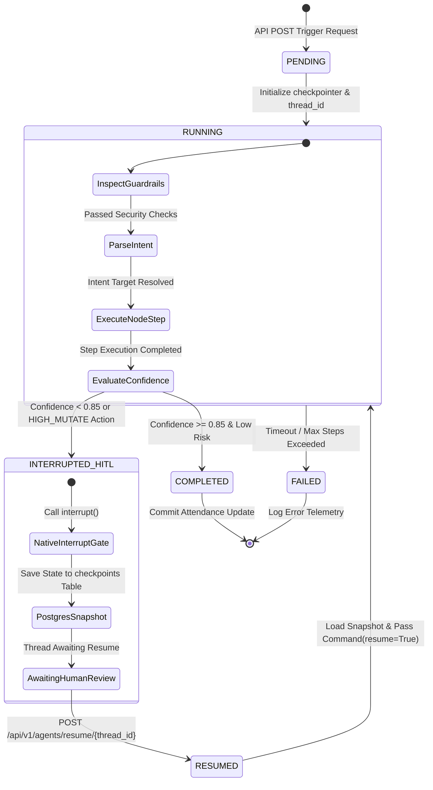
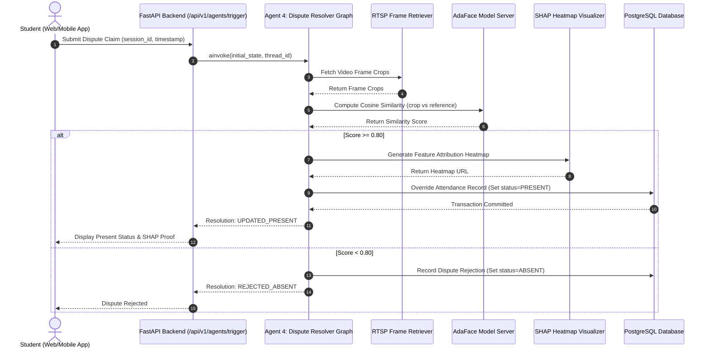
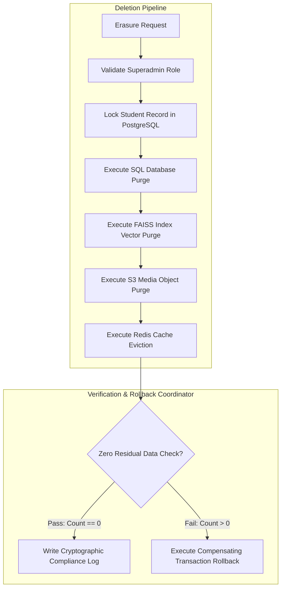
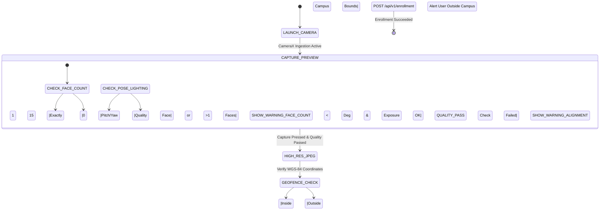
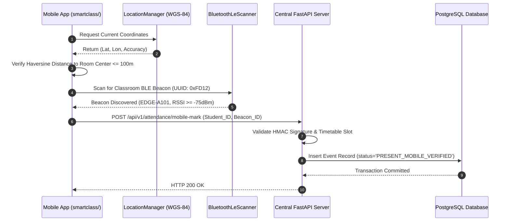

# 🏛️ SmartClass Platform: Reference Architecture & Systems Diagrams

> **Document Class:** Systems Architecture Reference & Diagrams Manual  
> **System Scope:** Edge Vision Engine (`src/`), Central FastAPI API (`services/app/`), Multi-Agent Ecosystem (`services/app/ai/`), Client Applications (`smartclass/` & `frontend/`), and Shared Libraries (`smartclass_common/`)  
> **Author:** Principal AI Systems Architect & Lead Embedded Vision Engineer  
> **Date:** July 2026  
> **Baseline Release:** SmartClass Platform v2.1

---

## 1. High-Level End-to-End Platform Topology

The **SmartClass Attendance Platform** decouples edge-based real-time video capture and face recognition from central business logic APIs, stateful multi-agent decision workflows, and administrative reporting dashboards.

```mermaid
graph TD
    subgraph Edge Classroom Deployment Tier
        E1["RTSP Camera 01 (Door)"] -->|H.264 Video Stream| MC["MultiCameraCapture Pool"]
        E2["RTSP Camera 02 (Hall)"] -->|H.264 Video Stream| MC
        MC --> SG["Stream Governor: Temp & FPS Scaling"]
        SG --> DET["SCRFD Face Detector (TensorRT FP16)"]
        DET --> TRK["ByteTrack Multi-Object Tracker"]
        TRK --> ALN["ArcFace 5-Point Affine Alignment"]
        ALN --> QUA["Face Quality & Passive Liveness Gate"]
        QUA -->|Pass (Q >= 0.25)| ENC["Ensemble Feature Extractor (AdaFace)"]
        ENC -->|512-D L2 Vector| FSS["Encrypted FAISS Search Index"]
        FSS --> EVE["Identity Evidence Engine"]
        EVE --> ATT["Ed25519 Hardware Attestation Signer"]
        ATT -->|Healthy Link| RDS["Redis Stream Gateway (XADD)"]
        ATT -->|Network Drop| SQL["SQLite WAL Offline Queue"]
        SQL -->|Reconnected| RDS
    end

    subgraph API Gateway & Administrative Control Tier
        RDS --> FAPI["FastAPI Central Backend Gateway"]
        WEB["React 18 Dashboard (Web/Admin)"] -->|REST / WebSockets| FAPI
        ANDR["Android Student App (Kotlin/Compose)"] -->|mTLS REST API| FAPI
        FAPI --> PII["PII Redaction & Security Middleware"]
        PII --> CACHE["Redis Semantic Vector Cache"]
        CACHE -->|Cache Miss| SV["Master Supervisor Orchestrator Agent"]
    end

    subgraph LangGraph Multi-Agent Execution Engine
        SV -->|Route Intent| A1["Agent 1: VLM Judge Graph"]
        SV -->|Route Intent| A2["Agent 2: OD Verifier Graph"]
        SV -->|Route Intent| A3["Agent 3: Substitute Dispatcher"]
        SV -->|Route Intent| A4["Agent 4: Dispute Resolver Graph"]
        SV -->|Route Intent| A5["Agent 5: DPDP Erasure Graph"]
        SV -->|Route Intent| A7["Agent 7: Student RAG Graph"]
    end

    subgraph Model Serving & Multi-Store Persistence
        A1 -->|Inference Call| TRITON["NVIDIA Triton Inference Pool"]
        A4 -->|Inference Call| TRITON
        A1 <--->|State Persist| DB[("PostgreSQL DB (checkpoints & events)")]
        A2 <--->|State Persist| DB
        A4 <--->|State Persist| DB
        A5 <--->|Purge Embeddings| VDB[("FAISS / Milvus Vector Store")]
        A5 <--->|Purge Cache Keys| CACHE
        A5 <--->|Purge DB Records| DB
    end
```

---

## 2. Edge Vision Processing Pipeline Architecture

The Edge Vision Engine operates within a **33.33ms execution budget** per frame to sustain real-time processing at **30 FPS**.

```mermaid
graph TD
    A[Raw RTSP Ingestion] --> B[GStreamer CUDA Frame Decoder]
    B --> C{Stream Governor Status}
    C -->|Normal Temp < 70C| D[Process Full 1080p Stream]
    C -->|Warning Temp 70-80C| E[Scale to 720p & Skip Alternate Frames]
    C -->|Critical Temp >= 80C| F[Drop to 10 FPS & Run Light MFN Model]
    
    D --> G[SCRFD Face Detection (TensorRT FP16)]
    E --> G
    F --> G
    
    G -->|BBox & Keypoints| H[ByteTrack Kalman-Filtered Tracker]
    H -->|Confirmed Track ID| I[ArcFace 5-Point Affine Alignment (112x112)]
    I --> J[Laplacian Blur Quality & Motion Liveness Check]
    
    J -->|Pass Q >= 0.25| K[AdaFace + MobileFaceNet Feature Extraction]
    J -->|Fail Q < 0.25| L[Drop Frame Crop]
    
    K -->|512-D L2 Vector| M[FAISS Vector Index Similarity Search]
    M --> N[9-Feature Identity Evidence Engine]
    N -->|Aggregate Score >= 0.85| O[Ed25519 TPM Attestation Signature]
    O --> P{Check Connection Health}
    P -->|Online| Q[Push to Redis Stream]
    P -->|Offline| R[Buffer in SQLite WAL Offline Queue]
```

---

## 3. LangGraph Stateful Multi-Agent Orchestration

The platform integrates **7 stateful autonomous agents** coordinates using LangGraph state graphs with native PostgreSQL database checkpointing (`AsyncPostgresSaver`).

### 3.1 LangGraph State Checkpoint & HITL Lifecycle

Low-confidence inferences ($P < 0.85$) or high-risk DB actions automatically trigger human-in-the-loop validation via `interrupt()`.



### 3.2 Target Agent Workflows

#### Agent 1: VLM Borderline Verification Judge
Visually compares borderline crops ($0.50 \le P < 0.85$) against enrolled photos using Qwen2.5-VL.

```mermaid
graph TD
    A[Start: Ingest Review Item] --> B[Retrieve Reference Enrollment Crops]
    B --> C[Invoke Qwen2.5-VL Visual Comparison]
    C --> D{Evaluate Similarity Score}
    D -->|Score >= 0.85| E[Commit Attendance Event Override]
    D -->|0.50 <= Score < 0.85| F[Call interrupt() Awaiting Admin Review]
    D -->|Score < 0.50| G[Reject Match Event]
    F -->|Admin Approves| E
    F -->|Admin Rejects| G
```

#### Agent 4: Attendance Dispute Resolver
Audits student attendance complaints, re-runs AdaFace recognition, and generates SHAP attribution heatmaps.



#### Agent 5: DPDP Act 2023 Compliance & Data Erasure
Transactionally erases student biometric data across all persistence layers with rollback capability.



---

## 4. Client Applications & Interfaces

### 4.1 CameraX Face Quality Gate (Mobile App)
Performs real-time face pre-processing on the user's mobile device to ensure high-quality enrollment crops.



### 4.2 BLE Beacon & Geofenced Mobile Attendance Scanner
Ensures students cannot mark attendance unless they are physically located inside the target classroom.



---

## 5. Enterprise Cloud & Edge Hybrid Deployment Topology

For enterprise multi-campus deployments, model serving and vector search scale out dynamically on cloud-native GPU nodes.

```
                        [ 🏢 EDGE NODES (100+ Campuses) ]
                                       │
                    RTSP / gRPC Encrypted Edge Streaming
                                       │
                                       ▼
             ┌──────────────────────────────────────────────────┐
             │       [ Apache Kafka / Redpanda Bus ]            │
             └────────────────────────┬─────────────────────────┘
                                       │
                                       ▼
             ┌──────────────────────────────────────────────────┐
             │     [ Ray Serve Orchestration Cluster ]          │
             └────────────────────────┬─────────────────────────┘
                                       │
                                       ▼
             ┌──────────────────────────────────────────────────┐
             │  [ NVIDIA Triton Inference Server GPU Pool ]     │
             │  - AdaFace IR-100 FP16 Engine (TensorRT)         │
             │  - CodeFormer Restoration & Depth-Anything V2    │
             │  - Dynamic Batching & GPU Instance Sharing       │
             └────────────────────────┬─────────────────────────┘
                                       │
                                       ▼
             ┌──────────────────────────────────────────────────┐
             │   [ Milvus / Qdrant Distributed Vector Cluster ] │
             │   - HNSW Index / GPU Acceleration                │
             │   - 100,000+ Student Vectors (<3ms Search)       │
             └────────────────────────┬─────────────────────────┘
                                       │
                                       ▼
             ┌──────────────────────────────────────────────────┐
             │  [ FastAPI Microservices + Async PostgreSQL ]    │
             │  - Polars High-Speed Analytics Engine            │
             │  - LangGraph Multi-Agent Workflows               │
             └──────────────────────────────────────────────────┘
```

---

## 6. Database Schema Checkpointing Tables

The system's PostgreSQL backend (`init.sql` & Alembic Migration 0016) utilizes the following checkpoint schema to persist LangGraph execution states:

```sql
-- LangGraph Checkpointer State Snapshot Store
CREATE TABLE IF NOT EXISTS checkpoints (
    thread_id TEXT NOT NULL,
    checkpoint_ns TEXT NOT NULL DEFAULT '',
    checkpoint_id TEXT NOT NULL,
    parent_checkpoint_id TEXT,
    type TEXT,
    checkpoint BYTEA NOT NULL,
    metadata JSONB NOT NULL DEFAULT '{}'::jsonb,
    created_at TIMESTAMP WITH TIME ZONE DEFAULT CURRENT_TIMESTAMP,
    PRIMARY KEY (thread_id, checkpoint_ns, checkpoint_id)
);

-- LangGraph Node Executions Output Store
CREATE TABLE IF NOT EXISTS checkpoint_writes (
    thread_id TEXT NOT NULL,
    checkpoint_ns TEXT NOT NULL DEFAULT '',
    checkpoint_id TEXT NOT NULL,
    task_id TEXT NOT NULL,
    idx INT NOT NULL,
    channel TEXT NOT NULL,
    type TEXT,
    value BYTEA NOT NULL,
    PRIMARY KEY (thread_id, checkpoint_ns, checkpoint_id, task_id, idx)
);
```
