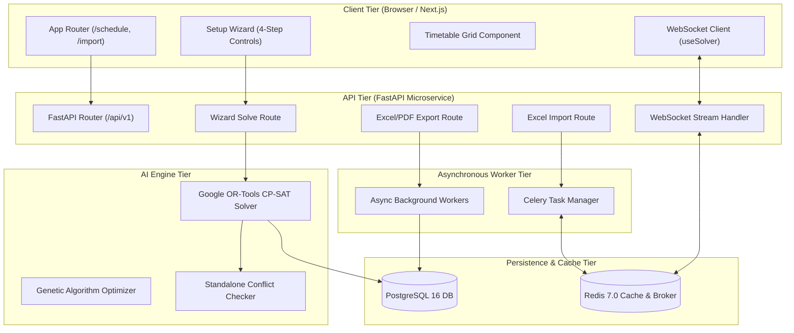
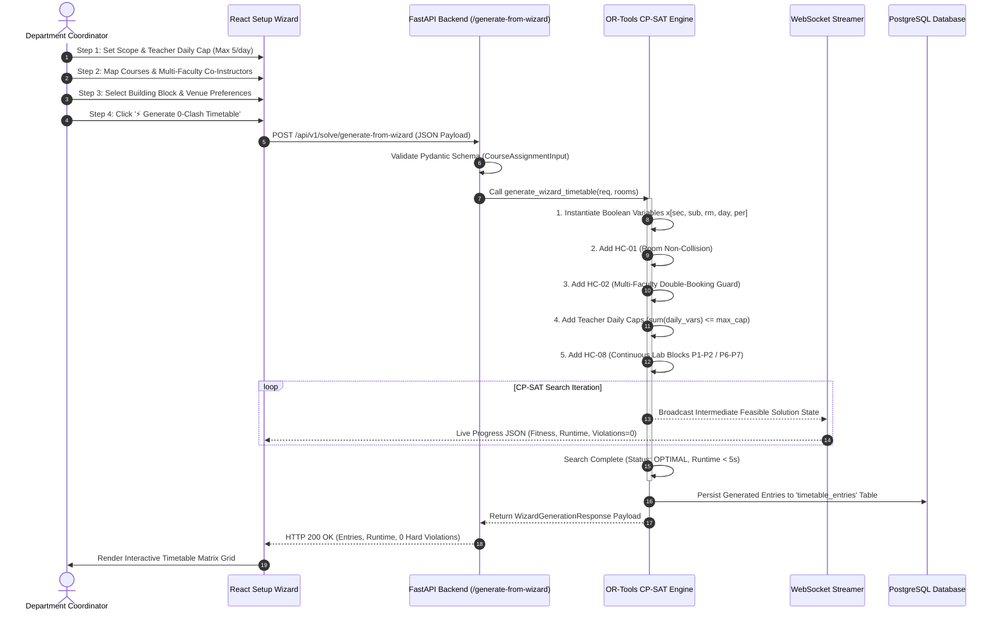

# 🏛️ System Architecture Documentation: VFSTR Timetable Generator

> **Platform:** Automated Conflict-Free Timetable Generator & Constraint Solver  
> **Target Institution:** Vignan’s Foundation for Science, Technology & Research (VFSTR Deemed-to-be-University)  
> **Department:** Advanced Computer Science & Engineering (ACSE)  
> **Author:** Principal Software Architect & Lead AI Engineer  

---

## 1. High-Level System Architecture Overview

The platform uses a **layered, decoupled, microservices-ready architecture** designed for high throughput, strict constraint satisfaction, real-time feedback streaming, and multi-tenant department scalability.

```
┌────────────────────────────────────────────────────────────────────────────────────────┐
│                                FRONTEND TIER (Next.js 14)                               │
│  • App Router Pages (/schedule, /import, /configure, /export, /dashboard)              │
│  • Components (ScheduleSetupWizard, TimetableGrid, ClashReport, FitnessChart)          │
│  • State & Hooks (useSolver WebSocket Client, useTimetable, useImport)                 │
│  • Design Tokens (design-system/tokens.css — SINGLE SOURCE OF TRUTH)                   │
└───────────────────────────────────┬────────────────────────────────────────────────────┘
                                    │ HTTP REST & WebSockets (ws://)
┌───────────────────────────────────▼────────────────────────────────────────────────────┐
│                                BACKEND TIER (FastAPI)                                  │
│  • API Routers (/api/v1/solve, /api/v1/import, /api/v1/export, /api/v1/validate)       │
│  • Business Services (Timetable Service, Faculty Workload Service)                     │
│  • Validation Engine (Pydantic v2 Schemas & Data Normalizer)                           │
└───────────────────┬───────────────────────────────────────────────┬────────────────────┘
                    │ Celery Task Queue                             │ Engine Calls
┌───────────────────▼──────────────────────┐    ┌───────────────────▼────────────────────┐
│           ASYNC TASK WORKERS             │    │             AI SOLVER ENGINE           │
│  • Celery Workers (Redis Broker)         │    │  • Primary: Google OR-Tools CP-SAT     │
│  • Asynchronous Excel Parser & Exporter  │    │  • Secondary: Genetic Algorithm (GA)   │
│  • PDF Batch Generation Engine           │    │  • Standalone Conflict Checker         │
└───────────────────┬──────────────────────┘    └───────────────────┬────────────────────┘
                    │                                               │
┌───────────────────▼───────────────────────────────────────────────▼────────────────────┐
│                             DATA STORAGE & CACHE LAYER                                 │
│  • PostgreSQL 16 (15 Relational Tables — Timetable Entries, Versions, Entity Specs)    │
│  • Redis 7.0 (Celery Broker, Task Results Backend, Pub/Sub Progress Streaming)         │
└────────────────────────────────────────────────────────────────────────────────────────┘
```

### Component Breakdown

1. **Frontend Presentation Tier (Next.js 14 App Router):**
   - Built with Next.js 14 (React 18), TypeScript, and Tailwind CSS.
   - Design System governed by `frontend/src/design-system/tokens.css` (primary blue `#1E40AF`, accent violet `#7C3AED`, success green `#059669`, clash red `#DC2626`).
   - Real-time interactive components include `ScheduleSetupWizard.tsx` (4-step configuration), `TimetableGrid.tsx` (6 days × 8 periods grid), and `SolverProgress.tsx` (live search trajectory).

2. **Backend Services Tier (FastAPI Framework):**
   - High-performance Python 3.11+ asynchronous service using FastAPI.
   - Pydantic v2 models enforce strict payload validation at API boundaries.
   - Route handlers delegate long-running constraint satisfaction to Celery tasks or direct CP-SAT solver calls.

3. **AI Constraint Engine Tier (Dual-Engine Architecture):**
   - **Google OR-Tools CP-SAT Engine (`csat_solver.py`):** Deterministic Constraint Programming solver converting scheduling rules into Integer Programming boolean decision variables $x_{s,c,r,d,p}$. Guaranteed 0-clash output in $<5\text{s}$.
   - **Genetic Algorithm Engine (`genetic_algorithm.py` & `fitness.py`):** Metaheuristic evolutionary search utilizing chromosome crossover, mutation, and elite preservation for global soft constraint optimization.
   - **Standalone Conflict Checker (`conflict_checker.py`):** Zero-DB dependency validation module detecting HC-01 through HC-10 violations.

4. **Data Persistence & Cache Tier:**
   - **PostgreSQL 16:** Relational database storing 15 core entities, audit logs, timetable versions, and solver run benchmarks.
   - **Redis 7.0:** In-memory message broker for Celery async tasks and WebSocket event streaming.

---

## 2. Visual Architecture & Data Flow Diagrams

### A. System Component Architecture Diagram



---

### B. Wizard to AI Solver End-to-End Sequence Diagram



---

## 3. Database Schema & Data Model Matrix

The PostgreSQL database comprises 15 relational tables engineered to support multi-department scheduling, version history, and audit compliance.

```
                                RELATIONAL SCHEMA ERD
┌──────────────────────┐        ┌──────────────────────┐        ┌──────────────────────┐
│     departments      │◄───────│       sections       │───────►│  timetable_entries   │
└──────────────────────┘        └──────────────────────┘        └──────────────────────┘
           ▲                                                               ▲
           │                                                               │
┌──────────────────────┐        ┌──────────────────────┐                   │
│       faculty        │        │        rooms         │───────────────────┤
└──────────────────────┘        └──────────────────────┘                   │
           ▲                                                               │
           │                                                               │
┌──────────────────────┐        ┌──────────────────────┐                   │
│       subjects       │        │     solver_runs      │───────────────────┘
└──────────────────────┘        └──────────────────────┘
```

| Table Name | Primary Key | Key Foreign Keys | Purpose / Description |
| --- | --- | --- | --- |
| `departments` | `id` | - | University departments (e.g., ACSE, ECE, CSE). |
| `sections` | `id` | `department_id` | Student sections (e.g., `II AIML-A`, `II AIML-B`, strength ~60). |
| `faculty` | `id` | `department_id` | Professors & instructors with AICTE max weekly hour limits. |
| `rooms` | `id` | - | Theory classrooms and computer labs (`601`, `604`, `AFTF-13`). |
| `subjects` | `id` | `department_id` | Courses with L-T-P credit structure and room type tags. |
| `section_subject_assignments`| `id` | `section_id`, `subject_id` | Subject quotas per section (e.g., DS Theory: 3h, DS Lab: 2h). |
| `faculty_subject_map` | `id` | `faculty_id`, `subject_id` | Faculty teaching eligibility matrix. |
| `time_slots` | `id` | - | Weekly period grid slots (MON–SAT, Periods 1–8, Tea & Lunch breaks). |
| `timetable_versions` | `id` | - | Versioning records (V1 through V5 baseline releases). |
| `timetable_entries` | `id` | `version_id`, `section_id`, `subject_id`, `room_id`, `slot_id` | Final scheduled cell assignments in the grid matrix. |
| `multi_faculty_assignments` | `id` | `timetable_entry_id`, `faculty_id` | Co-instructor / lab assistant mapping per scheduled slot. |
| `solver_runs` | `id` | `version_id` | Log of AI engine execution (algorithm, runtime, violations, config). |
| `constraint_definitions` | `id` | - | Hard (HC-01..10) and Soft (SC-01..10) constraint penalty metadata. |
| `clash_reports` | `id` | `version_id` | Audited clash details (Room conflict, Faculty double-booking). |
| `audit_logs` | `id` | - | Change history and manual slot edit logs. |

---

## 4. API Endpoint Directory

### REST API Endpoints (`/api/v1`)

| Endpoint Path | Method | Purpose / Function | Request Body Schema | Response Structure |
| --- | --- | --- | --- | --- |
| `/api/v1/solve/generate-from-wizard` | `POST` | Execute CP-SAT solver from setup wizard parameters | `TimetableGenerationRequest` | `WizardGenerationResponse` (Entries, runtime, status) |
| `/api/v1/import/excel` | `POST` | Upload & parse multi-sheet VFSTR Excel file (V5) | `multipart/form-data` (`file`) | `ImportSummaryResponse` (Sections, slots, clash count) |
| `/api/v1/export/excel` | `POST` | Download current timetable as formatted Excel file | `{ version_id: int }` | `binary/octet-stream` (`.xlsx` file download) |
| `/api/v1/export/pdf` | `POST` | Generate printable A4 section PDF timetables | `{ version_id: int, section_id: int }` | `application/pdf` (`.pdf` file download) |
| `/api/v1/validate/{version_id}` | `GET` | Run conflict checker against active timetable version | `Path: version_id` | `ValidationReport` (Hard/soft violations count, details) |
| `/api/v1/sections` | `GET` | Retrieve list of active sections with department filters | Query: `department`, `year` | `{ total: int, items: List[Section] }` |
| `/api/v1/faculty` | `GET` | Retrieve faculty list and weekly workload status | Query: `department` | `{ total: int, items: List[Faculty] }` |
| `/api/v1/rooms` | `GET` | Retrieve available classrooms & computer lab venues | Query: `block`, `type` | `{ total: int, items: List[Room] }` |
| `/api/v1/timetable/sync-master` | `POST` | Sync active timetable with University SmartClass API | Empty | `{ status: "SUCCESS", synced_slots: int }` |

### WebSocket Endpoint

| Protocol & Path | Direction | Payload Schema | Description |
| --- | --- | --- | --- |
| `WS /api/v1/solve/{run_id}/stream` | Server $\to$ Client | `{ type: string, generation: int, fitness: int, hard_violations: int, runtime_seconds: float }` | Streams live solver search trajectory and solution discovery events to frontend charts. |

---

## 5. Mathematical Constraint Formulation

The scheduling engine translates institutional policies into mathematical equations evaluated by **Google OR-Tools CP-SAT**. Let $x_{s, c, f, r, d, p} \in \{0, 1\}$ represent the decision variable for scheduling Section $s$, Course $c$, Faculty $f$, in Room $r$, on Day $d$, at Period $p$.

### A. Hard Constraints (Mandatory — Zero Violations)

1. **HC-01: Room Conflict (No Two Classes in Same Room at Same Time):**
   $$\sum_{s \in S} \sum_{c \in C} \sum_{f \in F} x_{s, c, f, r, d, p} \le 1 \quad \forall r \in R, \forall d \in D, \forall p \in P$$

2. **HC-02: Faculty Double-Booking Guard (Includes Primary + Co-Instructors):**
   $$\sum_{s \in S} \sum_{c \in C_f} \sum_{r \in R} x_{s, c, f, r, d, p} \le 1 \quad \forall f \in F, \forall d \in D, \forall p \in P$$

3. **HC-03: Student Section Conflict (No Section Attends Two Classes Simultaneously):**
   $$\sum_{c \in C} \sum_{f \in F} \sum_{r \in R} x_{s, c, f, r, d, p} \le 1 \quad \forall s \in S, \forall d \in D, \forall p \in P$$

4. **HC-04: Exact Subject Weekly Quota Satisfaction:**
   $$\sum_{d \in D} \sum_{p \in P} \sum_{r \in R} x_{s, c, f, r, d, p} = \text{WeeklyQuota}(s, c) \quad \forall s \in S, \forall c \in C_s$$

5. **HC-05 & HC-06: Room Capacity & Room Type Compatibility:**
   $$x_{s, c, f, r, d, p} = 0 \quad \text{if } \text{Capacity}(r) < \text{Students}(s) \lor \text{Type}(c) \neq \text{Type}(r)$$

6. **HC-07: Protected Tea Break & Lunch Break Slots:**
   $$x_{s, c, f, r, d, p} = 0 \quad \forall s, c, f, r, d, \quad \forall p \in \{\text{TeaBreak (09:55-10:10)}, \text{Lunch (12:40-01:40)}\}$$

7. **HC-08: Continuous Lab Period Allocation ($k=2$ or $k=3$):**
   $$x_{s, c_{\text{lab}}, f, r, d, p} = 1 \implies x_{s, c_{\text{lab}}, f, r, d, p+1} = 1 \quad \forall p \in \{1, 6\}$$

8. **HC-09: Teacher Daily Teaching Cap ($\le 5 \text{ or } 6 \text{ classes/day}$):**
   $$\sum_{p=1}^{8} \sum_{s \in S} \sum_{c \in C_f} \sum_{r \in R} x_{s, c, f, r, d, p} \le \text{MaxDailyCap}_f \quad \forall f \in F, \forall d \in D$$

9. **HC-10: Maximum Continuous Teaching Limit for Faculty:**
   $$\sum_{k=0}^{3} \sum_{s \in S} \sum_{c \in C_f} \sum_{r \in R} x_{s, c, f, r, d, p+k} \le 3 \quad \forall f \in F, \forall d \in D, \forall p \in \{1..5\}$$

---

### B. Soft Penalty Objective Function (Optimization Criteria)

The AI engine minimizes total soft penalty score $Z$:

$$\min Z = w_1 \cdot \text{Cost}_{\text{Gaps}} + w_2 \cdot \text{Cost}_{\text{Spread}} + w_3 \cdot \text{Cost}_{\text{LabTime}} + w_4 \cdot \text{Cost}_{\text{BuildingWalk}}$$

Where:
- $\text{Cost}_{\text{Gaps}} = \sum_{s, d} \text{IdleGapPeriods}(s, d)$ (Penalizes student idle gap hours).
- $\text{Cost}_{\text{Spread}} = \sum_{s, c} | \text{DailyHours}(s, c) - 1 |$ (Distributes subject lectures evenly across days).
- $\text{Cost}_{\text{LabTime}} = \sum_{s, c_{\text{lab}}} x_{s, c_{\text{lab}}, f, r, d, p=6}$ (Prefers morning lab slots P1–P2 over afternoon slots P6–P7).
- Weights: $w_1 = 50, w_2 = 30, w_3 = 20, w_4 = 10$.
