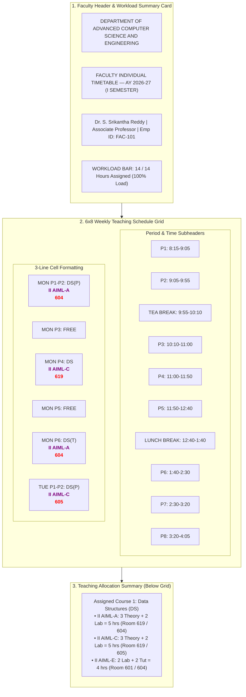
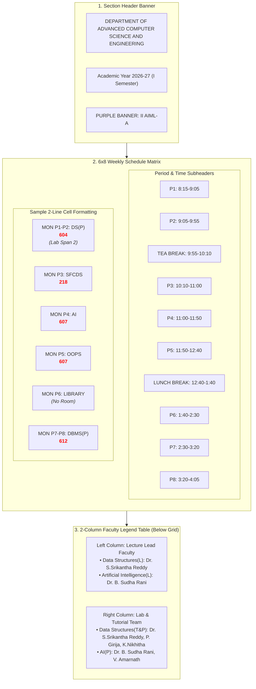
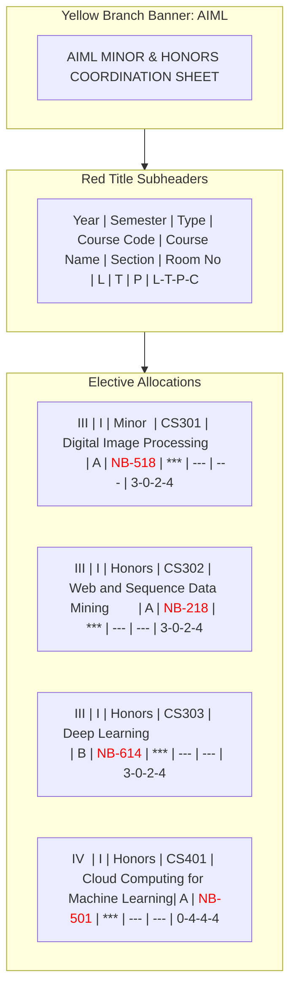

# Teacher's (Faculty) Timetable Analysis & Mermaid Visualizations

The **Teacher's / Faculty Individual Timetable** is structurally different from a Section Timetable. 

While a **Section Timetable** shows *what subject is taught in which room*, a **Teacher's Timetable** shows *which section the teacher is instructing, which subject, and in which room*, along with their **Weekly Workload Summary**.

---

## 1. Structural Breakdown of Teacher's Timetable

### A. Header & Workload Card
- **Header**: `DEPARTMENT OF ADVANCED COMPUTER SCIENCE AND ENGINEERING`
- **Subheader**: `FACULTY INDIVIDUAL TIMETABLE — AY 2026-27 (I SEMESTER)`
- **Faculty Metadata Box**:
  - **Faculty Name**: `Dr. S. Srikantha Reddy`
  - **Designation**: `Associate Professor` | **Employee ID**: `FAC-101`
  - **Workload Bar**: `14 Assigned Slots / 14 Max Weekly Limit` (AICTE Compliant)

### B. 3-Line Grid Cell Anatomy (Faculty Matrix)
In a section grid, line 2 is the room code. In a **Teacher's grid**, each slot cell has **3 lines**:
$$\begin{array}{|c|}
\hline
\mathbf{\text{DS(P)}} \quad \text{\small(Black Text: Subject Code + Type)} \\
\color{purple}{\mathbf{\text{II AIML-A}}} \quad \text{\small(Purple Text: Target Section Name)} \\
\color{red}{\mathbf{604}} \quad \text{\small(Red Bold Text: Room Code)} \\
\hline
\end{array}$$

- **Empty Slot**: Marked as `FREE` or blank (Teacher is available for research/grading).
- **Recess Slots**: `BREAK` (09:55–10:10) and `LUNCH` (12:40–1:40) shaded in light grey.

### C. Course Workload Legend Table (Below Grid)
Lists all sections and courses assigned to this specific teacher across the week:
- **Course Code & Title**: e.g., `Data Structures (DS)`
- **Section Allocations**: `II AIML-A (L+P)`, `II AIML-C (L+P)`, `II AIML-E (L+P)`
- **Total Hours Taught**: `14 Hours / Week`

---

## 2. Mermaid Diagram: Teacher's (Faculty) Timetable Layout



---

## 3. Visual Layout Mockup: Teacher's Timetable (`Dr. S. Srikantha Reddy`)

### **DEPARTMENT OF ADVANCED COMPUTER SCIENCE AND ENGINEERING**
#### **FACULTY INDIVIDUAL TIMETABLE — AY 2026- 27 (I Semester)**
**Faculty Name:** Dr. S. Srikantha Reddy | **Designation:** Associate Professor | **Emp ID:** FAC-101  
**Weekly Workload:** 14 Hours Assigned / 14 Hours Max (AICTE Limit)

| **Dr. S. Srikantha Reddy** | | | | | | | | | | |
|:---:|:---:|:---:|:---:|:---:|:---:|:---:|:---:|:---:|:---:|:---:|
| **Period** | **1** | **2** | **09:55 - 10:10** | **3** | **4** | **5** | **12:40 - 1:40** | **6** | **7** | **8** |
| **Day/Hour** | **8:15-9:05** | **9:05-09:55** | | **10:10-11:00** | **11:00-11:50** | **11:50-12:40** | | **1:40-2:30** | **2:30-3:20** | **3:20-4:05** |
| **MON** | DS(P)<br/><span style="color:purple;font-weight:bold;">II AIML-A</span><br/><span style="color:red;font-weight:bold;">604</span> | DS(P)<br/><span style="color:purple;font-weight:bold;">II AIML-A</span><br/><span style="color:red;font-weight:bold;">604</span> | **B<br/>R<br/>E<br/>A<br/>K** | FREE | DS<br/><span style="color:purple;font-weight:bold;">II AIML-C</span><br/><span style="color:red;font-weight:bold;">619</span> | FREE | **L<br/>U<br/>N<br/>C<br/>H** | DS(T)<br/><span style="color:purple;font-weight:bold;">II AIML-A</span><br/><span style="color:red;font-weight:bold;">604</span> | FREE | FREE |
| **TUE** | DS(P)<br/><span style="color:purple;font-weight:bold;">II AIML-C</span><br/><span style="color:red;font-weight:bold;">605</span> | DS(P)<br/><span style="color:purple;font-weight:bold;">II AIML-C</span><br/><span style="color:red;font-weight:bold;">605</span> | | DS<br/><span style="color:purple;font-weight:bold;">II AIML-A</span><br/><span style="color:red;font-weight:bold;">619</span> | FREE | FREE | | FREE | DS<br/><span style="color:purple;font-weight:bold;">II AIML-E</span><br/><span style="color:red;font-weight:bold;">601</span> | FREE |
| **WED** | FREE | DS<br/><span style="color:purple;font-weight:bold;">II AIML-A</span><br/><span style="color:red;font-weight:bold;">619</span> | | FREE | DS<br/><span style="color:purple;font-weight:bold;">II AIML-C</span><br/><span style="color:red;font-weight:bold;">619</span> | FREE | | DS(P)<br/><span style="color:purple;font-weight:bold;">II AIML-E</span><br/><span style="color:red;font-weight:bold;">604</span> | DS(P)<br/><span style="color:purple;font-weight:bold;">II AIML-E</span><br/><span style="color:red;font-weight:bold;">604</span> | FREE |
| **THU** | FREE | FREE | | FREE | DS<br/><span style="color:purple;font-weight:bold;">II AIML-E</span><br/><span style="color:red;font-weight:bold;">601</span> | FREE | | FREE | DS<br/><span style="color:purple;font-weight:bold;">II AIML-A</span><br/><span style="color:red;font-weight:bold;">619</span> | FREE |
| **FRI** | FREE | FREE | | FREE | FREE | FREE | | DS<br/><span style="color:purple;font-weight:bold;">II AIML-A</span><br/><span style="color:red;font-weight:bold;">619</span> | DS(T)<br/><span style="color:purple;font-weight:bold;">II AIML-C</span><br/><span style="color:red;font-weight:bold;">619</span> | FREE |
| **SAT** | FREE | FREE | | FREE | FREE | DS<br/><span style="color:purple;font-weight:bold;">II AIML-A</span><br/><span style="color:red;font-weight:bold;">619</span> | | FREE | FREE | FREE |

#### **Teaching Allocation Summary**
| **Course Code & Title** | **Assigned Sections** | **Weekly Hours** | **Primary Rooms** |
|:---|:---|:---:|:---|
| Data Structures (DS) — Theory | II AIML-A, II AIML-C, II AIML-E | 8 Hours | 619, 601 |
| Data Structures Lab (DS-P) — Practical | II AIML-A, II AIML-C, II AIML-E | 6 Hours | 604, 605 |
| **Total Teaching Load** | **3 Sections** | **14 Hours / Wk** | **AICTE Compliant ✅** |

---

## 4. Universal Export Standard Across All Downloads

When downloading Excel (`.xlsx`) or PDF files, **all 6 export formats will strictly mirror these exact layout standards**:

```
 ┌─────────────────────────────────────────────────────────────────────────────┐
 │                       EXPORTS & DOWNLOAD STANDARDS                          │
 ├──────────────────────────┬──────────────────────────────────────────────────┤
 │ 1. Single Section Export │ • Section Grid + 2-Line Cell (Black Subj / Red Room)│
 │    (Excel & PDF)         │ • 2-Column Faculty Legend Table below grid       │
 ├──────────────────────────┼──────────────────────────────────────────────────┤
 │ 2. Master Dept Workbook  │ • Sheet 1: All 44 sections stacked vertically     │
 │    (Excel)               │   with Purple Section Banners + 3-row spacers     │
 │                          │ • Sheets 2–45: Individual Section Tabs           │
 ├──────────────────────────┼──────────────────────────────────────────────────┤
 │ 3. Cohort Excel Export   │ • Cohort Master Stacked Sheet                    │
 │    (e.g., II_AIML)       │ • Section Tabs for target cohort                 │
 ├──────────────────────────┼──────────────────────────────────────────────────┤
 │ 4. Teacher's Timetable   │ • 3-Line Cell (Black Subj / Purple Sec / Red Room)│
 │    (Single PDF / Excel)  │ • Workload Summary Card & Allocation Table       │
 ├──────────────────────────┼──────────────────────────────────────────────────┤
 │ 5. Faculty PDF Bundle    │ • Multi-page PDF (1 page per faculty member)     │
 │    (All 80 Faculty)      │ • Includes Workload counter & Section matrix     │
 ├──────────────────────────┼──────────────────────────────────────────────────┤
 │ 6. Minors / Honors Sheet │ • Yellow Branch Banners (#FACC15)                │
 │    (Excel & PDF)         │ • Red Title Headers (#DC2626)                    │
 └──────────────────────────┴──────────────────────────────────────────────────┘
```

---

## Ready for Confirmation

Please review the **Teacher's Timetable layout mockup**, Mermaid diagram, and the **Universal Export Standard** table above.

When you reply **"proceed to start"**, I will proceed to start executing all export renderers, PDF generators, and UI grid components to enforce this standard!


# VFSTR Timetable Pattern Analysis & Mermaid Visualizations

We have analyzed all **46 real timetable screenshots** (`time table/` folder) and all **5 Excel dataset revisions** (`time_table/` folder). Below is the complete structural breakdown and **Mermaid visual diagrams** showing exactly how the generated timetables look.

---

## 1. Identified Patterns Across All 46 Screenshots

### A. Overall Document & Header Structure
1. **Department Banner**: `DEPARTMENT OF ADVANCED COMPUTER SCIENCE AND ENGINEERING` (Centered, Bold).
2. **Academic Period Sub-banner**: `Academic year 2026- 27 (I Semester)`.
3. **Purple Section Header Banner**: Spans all 11 columns in **Soft Purple / Lavender (`#C084FC`)** with bold section label (e.g., `II AIML-A`, `III AIML-F`, `IV AIML-B`).

### B. 11-Column Timeslot Grid Layout
- **Col 1 (`Day/Hour`)**: Days `MON`, `TUE`, `WED`, `THU`, `FRI`, `SAT`.
- **Cols 2–3 (P1 & P2)**: `08:15-09:05` and `09:05-09:55`.
- **Col 4 (`BREAK`)**: **`09:55 - 10:10`** (15-min Tea Break — merged vertically `B-R-E-A-K`).
- **Cols 5–7 (P3, P4, P5)**: `10:10-11:00`, `11:00-11:50`, `11:50-12:40`.
- **Col 8 (`LUNCH`)**: **`12:40 - 1:40`** (60-min Lunch Break — merged vertically `L-U-N-C-H`).
- **Cols 9–11 (P6, P7, P8)**: `1:40-2:30`, `2:30-3:20`, `3:20-4:05`.

### C. Exact 2-Line Cell Anatomy
Every assigned slot cell contains **2 distinct lines**:
$$\begin{array}{|c|}
\hline
\mathbf{\text{DS(P)}} \quad \text{\small(Black Text: Subject Code + Suffix)} \\
\color{red}{\mathbf{604}} \quad \text{\small(Red Bold Text: Room Code)} \\
\hline
\end{array}$$

- **Theory Lecture `(L)`**: Suffix omitted or explicit (e.g., `DS`, `AI`, `SFCDS`).
- **Practical Lab `(P)`**: `(P)` suffix, spans **2 consecutive periods**, uses lab rooms (`604`, `AFTF-12`).
- **Tutorial `(T)`**: `(T)` suffix, 1 period, classroom.
- **Special Slots**: `LIBRARY` (no room), `OE` (NPTEL, no room), `SL/EL` (self-learning), `CRT` (placement training).
- **Minors / Honors `(M/H)`**: Synchronized Wed/Thu P7–P8, room code listed in red (e.g. `NB-518`, `402`).

### D. 2-Column Faculty Allocation Legend Table
Positioned immediately below the 6×8 section grid:
- **Left Column (Cols 1–5)**: Lecture Lead Faculty (e.g., `Data Structures(L): Dr. S.Srikantha Reddy`).
- **Right Column (Cols 6–11)**: Practical & Tutorial Instructor Teams (e.g., `Data Structures(T&P): Dr. S.Srikantha Reddy, P. Girija, K.Nikhitha, Mr. Mahendra Varma`).

---

## 2. Mermaid Diagram: Timetable Grid & Cell Layout

Below is the **Mermaid diagram** representing the exact layout of a generated section timetable (`II AIML-A`):



---

## 3. Mermaid Diagram: Minors/Honors Master Coordination Sheet

This diagram represents the **Minors/Honors Master Allocation Sheet** (Screenshot 46 / Tab `MINORHONORS`):



---

## 4. Visual Layout Mockup: Generated Section Timetable (`II AIML-A`)

Here is the exact visual markdown layout of a generated timetable matching the screenshots:

### **DEPARTMENT OF ADVANCED COMPUTER SCIENCE AND ENGINEERING**
#### **Academic year 2026- 27 (I Semester)**

| **II AIML-A** | | | | | | | | | | |
|:---:|:---:|:---:|:---:|:---:|:---:|:---:|:---:|:---:|:---:|:---:|
| **Period** | **1** | **2** | **09:55 - 10:10** | **3** | **4** | **5** | **12:40 - 1:40** | **6** | **7** | **8** |
| **Day/Hour** | **8:15-9:05** | **9:05-09:55** | | **10:10-11:00** | **11:00-11:50** | **11:50-12:40** | | **1:40-2:30** | **2:30-3:20** | **3:20-4:05** |
| **MON** | DS(P)<br/><span style="color:red;font-weight:bold;">604</span> | DS(P)<br/><span style="color:red;font-weight:bold;">604</span> | **B<br/>R<br/>E<br/>A<br/>K** | SFCDS<br/><span style="color:red;font-weight:bold;">218</span> | AI<br/><span style="color:red;font-weight:bold;">607</span> | OOPS<br/><span style="color:red;font-weight:bold;">607</span> | **L<br/>U<br/>N<br/>C<br/>H** | LIBRARY | DBMS(P)<br/><span style="color:red;font-weight:bold;">612</span> | DBMS(P)<br/><span style="color:red;font-weight:bold;">612</span> |
| **TUE** | AI(P)<br/><span style="color:red;font-weight:bold;">604</span> | AI(P)<br/><span style="color:red;font-weight:bold;">604</span> | | SFCDS<br/><span style="color:red;font-weight:bold;">215</span> | DEF<br/><span style="color:red;font-weight:bold;">215</span> | DMS<br/><span style="color:red;font-weight:bold;">616</span> | | DS<br/><span style="color:red;font-weight:bold;">619</span> | OOPS(T)<br/><span style="color:red;font-weight:bold;">604</span> | DMS(T)<br/><span style="color:red;font-weight:bold;">616</span> |
| **WED** | DBMS<br/><span style="color:red;font-weight:bold;">611</span> | DS<br/><span style="color:red;font-weight:bold;">619</span> | | OOPS(P)<br/><span style="color:red;font-weight:bold;">606</span> | OOPS(P)<br/><span style="color:red;font-weight:bold;">606</span> | AI<br/><span style="color:red;font-weight:bold;">607</span> | | SFCDS(P)<br/><span style="color:red;font-weight:bold;">611</span> | SFCDS(P)<br/><span style="color:red;font-weight:bold;">611</span> | DMS<br/><span style="color:red;font-weight:bold;">215</span> |
| **THU** | OOPS<br/><span style="color:red;font-weight:bold;">607</span> | DBMS<br/><span style="color:red;font-weight:bold;">611</span> | | DEF(P)<br/><span style="color:red;font-weight:bold;">605</span> | DEF(P)<br/><span style="color:red;font-weight:bold;">605</span> | DMS<br/><span style="color:red;font-weight:bold;">218</span> | | AI<br/><span style="color:red;font-weight:bold;">607</span> | DS<br/><span style="color:red;font-weight:bold;">619</span> | DS(T)<br/><span style="color:red;font-weight:bold;">604</span> |
| **FRI** | SFCDS<br/><span style="color:red;font-weight:bold;">218</span> | AI<br/><span style="color:red;font-weight:bold;">607</span> | | DMS<br/><span style="color:red;font-weight:bold;">616</span> | DBMS<br/><span style="color:red;font-weight:bold;">611</span> | OOPS<br/><span style="color:red;font-weight:bold;">607</span> | | DS<br/><span style="color:red;font-weight:bold;">619</span> | DBMS(T)<br/><span style="color:red;font-weight:bold;">607</span> | DEF<br/><span style="color:red;font-weight:bold;">215</span> |
| **SAT** | DEF<br/><span style="color:red;font-weight:bold;">514-A</span> | AI<br/><span style="color:red;font-weight:bold;">514-A</span> | | DBMS<br/><span style="color:red;font-weight:bold;">514-A</span> | SFCDS<br/><span style="color:red;font-weight:bold;">514-A</span> | DS<br/><span style="color:red;font-weight:bold;">619</span> | | DMS(T)<br/><span style="color:red;font-weight:bold;">514-A</span> | OOPS(T)<br/><span style="color:red;font-weight:bold;">514-A</span> | FREE |

#### **Faculty Allocation Legend Table**
| **Lecture Faculty** | **Practical & Tutorial Faculty Team** |
|:---|:---|
| Statistical Foundation for Computing(L): DR. P. Kalpana | Statistical Foundation for Computing(P): DR. P. Kalpana, Mr. Mahendra Varma |
| Discrete Mathematical Structures(L): DR. ANKAMMA RAO MALLELA | Discrete Mathematical Structures(T): DR. ANKAMMA RAO MALLELA |
| Data Structures(L): Dr. S.Srikantha Reddy | Data Structures(T&P): Dr. S.Srikantha Reddy, P. Girija, K.Nikhitha |
| Artificial Intelligence(L): Dr. B. Sudha Rani | Artificial Intelligence(P): Dr. B. Sudha Rani, V. Amarnath |
| Database Management Systems(L): Ms. P. Seetha Lakshmi | DBMS(T&P): Ms. P. Seetha Lakshmi, CHALLA SAI MOHITHA, GUNTI VASANTHI |
| Object Oriented Programming(L): Ms. G. Mahalakshmi | OOPS(T&P): Ms. G. Mahalakshmi, PALAPARTHI YAMUNA, PALLAKI SRI HARSHAVARDHAN REDDY |

---

## Ready for Confirmation

Please review the pattern analysis, Mermaid diagrams, and visual layout mockup above. 

When you reply **"proceed to start"**, I will begin implementing any final visual tweaks or generation code to match this exact layout format across all pages and exports!